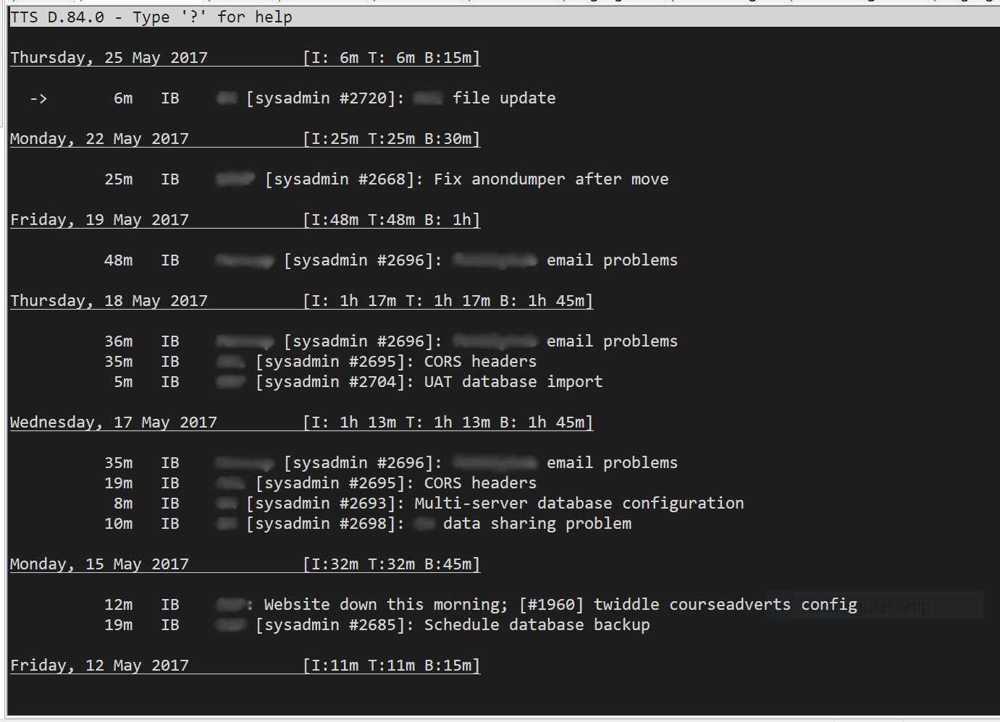

TTS - Time-tracking software
============================

TTS is a simple, text-based (curses) time-tracking application.  It allows you
to track the time you spend working by client, project, etc. to allow accurate
invoicing of clients or reporting to a corporate time-tracking system.  It
uses a simple text format to store data which can easily be parsed to export
data to another system automatically.  Entries can be added in bulk or in real
time using a timer, and invoiced and non-billable entries are tracked.
Entries can optionally be rounded up to a minimum billing increment.

Screenshot
----------

Installation
------------

TTS has been tested on FreeBSD, NetBSD, Solaris, Cygwin and Linux, with the
following caveats:

	- Wide character support does not work with Unicode using Solaris
	  curses, which appears to only support EUC.  Use ncurses instead.

	- Wide character support does not work at all on Cygwin; TTS must
	  be compiled with --without-ncursesw.  Patches welcome.

TTS uses autoconf and can be built as follows:

	$ ./configure
	$ make
	# make install

After starting with 'tts', type '?' for help.

Quick start
-----------

* Press 'a' to add a new entry, and enter its name.  The timer starts running.
* Press space to toggle the timer on and off.
* Press 'A' to add an entry and have TTS prompt for its initial time.
* Press 'd' to delete an entry, and 'u' to undelete it.
* Press 'e' to edit an entry's description, or '\' to edit its time.
* Press '+' to add time to an entry or '-' to remove time.
* Press '?' for more help, and look at the sample .ttsrc.
* When you're working on something and something else comes up, press 'r' to
  start the interrupt timer.  When you're done with the other thing, press 'r'
  again to assign the interrupt time to a new entry.

Contact
-------

To report problems or request features, please use the GitHub issue tracker at
<https://github.com/ftarnell/tts/issues>.  This requires that you have a GitHub
account.
